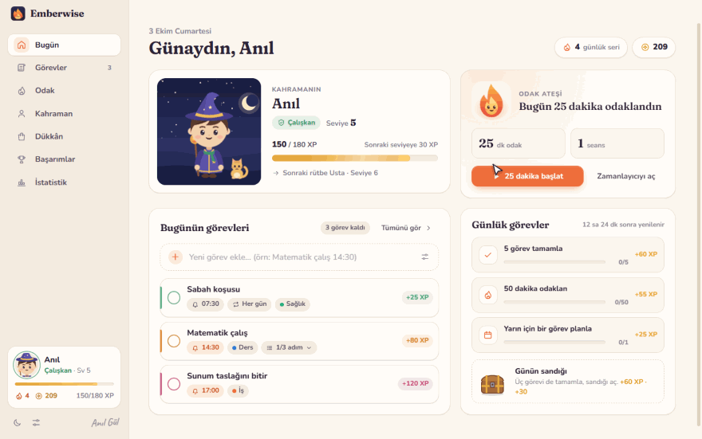
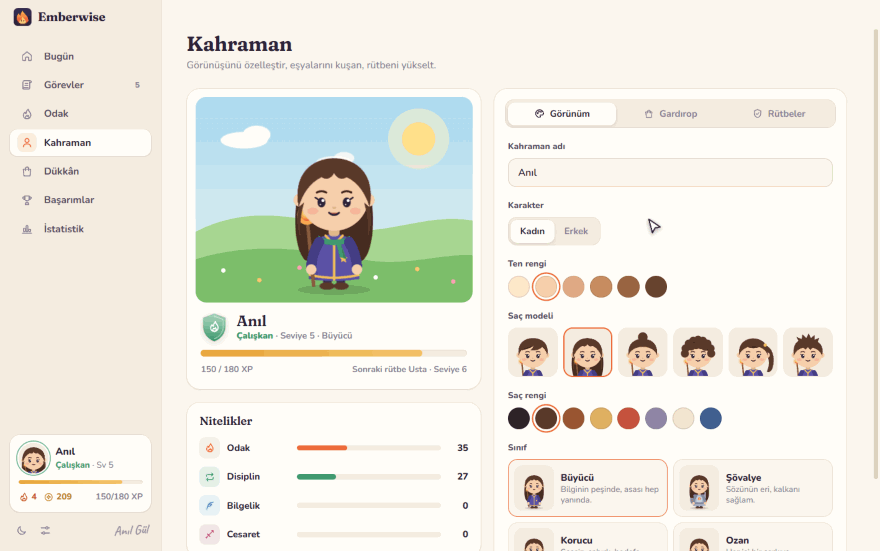
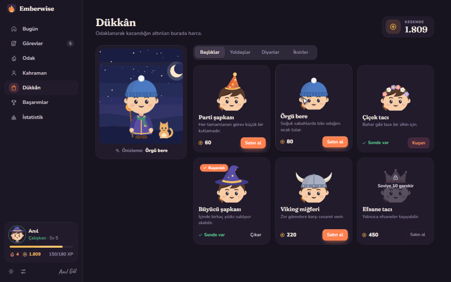
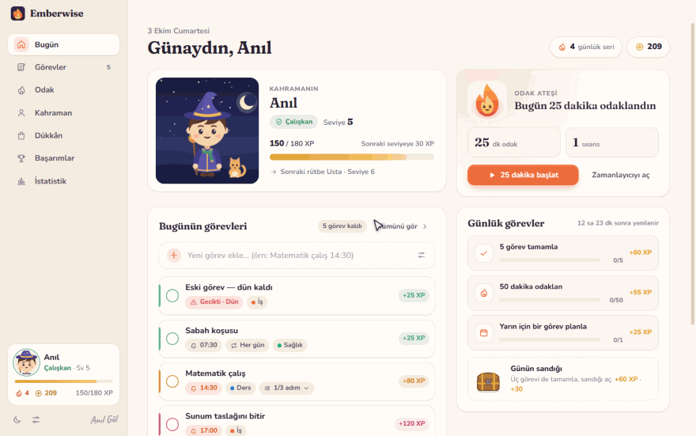
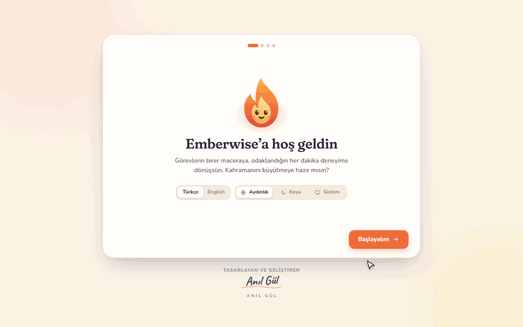

<picture>
  <source media="(prefers-color-scheme: dark)" srcset="media/banner-dark.svg">
  
</picture>

 
 

&nbsp;
&nbsp;

Ücretsiz · Hesap yok, reklam yok · İnternet bağlantısı gerekmez · <a href="https://github.com/anilg12/Emberwise">Kaynak kodu</a> · <a href="https://github.com/anilg12/Emberwise/releases">Tüm sürümler</a>

 

**Odak Menajeri RPG**'yi odaklanmakta zorlandığım bir dönemde kendime bir çare olsun diye JavaFX ile yazmıştım. Görev ekliyor, saati gelince hatırlatıyor, bitirince 50 XP veriyordu. Fikri çok sevdim ama yarım kaldı.

Şimdi baştan aşağı yeniden yazıldı ve adı **Emberwise** oldu. Windows'ta ve Mac'te çalışan, görevlerini maceraya, odaklandığın her dakikayı deneyime çeviren, kendi kahramanını büyüttüğün sıcak bir odak oyunu.

 

  

## Görev ekle, bitir, seviye atla

Göreve bir ad ve bir amaç yaz (*"Neden yapıyorsun?"*), istersen saat kur. Acelen varsa kutuya `Matematik çalış 14:30` yazıp Enter'a basman yeter: saat de hatırlatıcı da kendiliğinden ayarlanır, sonuna `yarın` eklersen yarına düşer.

Bitirdiğin her görev zorluğuna göre **25 ile 120 XP** arası ve biraz altın getirir. Seviye atladığında küçük bir kutlama, rütbe atladığında yeni unvanın seni bekler. Tekrarlayan görevler, alt adımlar, kategoriler ve arama da var.

## Odak ateşi

  

Pomodoro zamanlayıcısını başlat, kor ruhu sen odaklandıkça büyüsün. Seans bitince XP ve altın kazanır, kısa bir molaya geçersin. Yağmur, şömine, dalga, rüzgâr ya da derin bir uğultu eşlik edebilir; bu seslerin hepsi uygulamanın içinde anlık üretilir, internet istemez. Kalan süre sistem tepsisinde ve görev çubuğunda da görünür.

## Kahramanını sen tasarla

  

Kadın ya da erkek, ten rengi, altı saç modeli, sekiz saç rengi ve dört sınıf: Büyücü, Şövalye, Korucu, Ozan. Rütben yükseldikçe kahramanın atkı, pelerin ve parıltı kazanır. Odak, Disiplin, Bilgelik ve Cesaret nitelikleri de senin alışkanlıklarına göre büyür.

## Dükkân, yoldaşlar ve diyarlar

  

Odaklanarak kazandığın altınla şapka, yoldaş ve diyar alırsın. Kedi Pamuk, Baykuş Bilge, Tilki Kıvılcım, Kor Ruhu ve Yavru Ejder seni bekliyor. Yıldızlı gece, eski kütüphane, kamp ateşi, sakura bahçesi ve kutup ışıkları gibi diyarlar da var. Üzerine gelince kahramanın üstünde önizlenir. Seriyi koruyan *Kor kalkanı* da burada.

## Aydınlık mı, koyu mu?

  

Aydınlık, koyu ya da sisteme göre. Altı vurgu rengi, Türkçe ve İngilizce arayüz, azaltılmış hareket seçeneği. İlk açılışta dil ve tema bilgisayarına göre kendiliğinden seçilir.

## Rütbeler

<picture>
  <source media="(prefers-color-scheme: dark)" srcset="media/ranks-dark.svg">
  
</picture>

Orijinal dört rütbe aynen duruyor: **Acemi → Çalışkan → Usta → Efsane**. Gerçekten azimli olanlar için iki yenisi geldi: **Mitik** ve **Ölümsüz**. Bunların yanında günlük görevler ve günün sandığı, günlük seri, 24 başarım ve odak grafikleriyle bir istatistik sayfası da var.

## İlk açılış

  

## Neler değişti?

| | Odak Menajeri RPG (JavaFX) | Emberwise |
| --- | --- | --- |
| Nasıl çalışır? | IDE içinde açılan tek bir Java dosyası | Windows ve macOS (M1–M5 ve Intel) için kurulum |
| Karakter | Emoji (🧙 / 🧝) | Elle çizilmiş, giydirilebilen kahraman ve yoldaşlar |
| Görevler | Ad, amaç, saat | + zorluk, kategori, tarih, tekrar, adımlar, arama |
| Hatırlatıcı | Uygulama içi uyarı penceresi | Masaüstü bildirimi ve ses; pencere kapalıyken tepsiden çalışır |
| XP | Görev başına +50 | Zorluğa göre 25–120, odak süresi, günlük görevler, başarımlar |
| Rütbe | Acemi → Efsane | Acemi → Çalışkan → Usta → Efsane → Mitik → Ölümsüz |
| Görünüm | Koyu tema | Aydınlık, koyu, sisteme göre ve 6 vurgu rengi |
| Dil | Türkçe | Türkçe ve İngilizce |
| Veriler | Kapatınca sıfırlanır | Bilgisayarında saklanır, yedek alınabilir |

## Kurulum

**Windows 10 / 11:** [`Emberwise-Setup.exe`](https://github.com/anilg12/Emberwise/releases/latest/download/Emberwise-Setup.exe) dosyasına çift tıkla. Yönetici izni istemez; kurulur, masaüstüne kısayol koyar ve kendiliğinden açılır. Windows "bilgisayarınızı korudu" uyarısı gösterirse **Ek bilgi → Yine de çalıştır** de (uygulama henüz ücretli bir sertifikayla imzalanmadı).

**macOS:** Apple Silicon (M1–M5 ve sonrası) için [`Emberwise-mac-arm64.dmg`](https://github.com/anilg12/Emberwise/releases/latest/download/Emberwise-mac-arm64.dmg), Intel için [`Emberwise-mac-x64.dmg`](https://github.com/anilg12/Emberwise/releases/latest/download/Emberwise-mac-x64.dmg). Dosyayı aç, Emberwise'ı **Uygulamalar** klasörüne sürükle. İlk açılışta uygulamaya **sağ tık → Aç** de ya da **Sistem Ayarları → Gizlilik ve Güvenlik → Yine de Aç**'ı kullan.

Tüm verilerin yalnızca kendi bilgisayarında saklanır. Kaynak kod, geliştirme notları ve sürümler için: **[github.com/anilg12/Emberwise](https://github.com/anilg12/Emberwise)**

 

<b>İlk sürüm: Odak Menajeri RPG (JavaFX)</b>

 

Zamanı yönetmek artık sıkıcı değil.
**Focus Manager RPG**, görev takibini eğlenceli bir RPG deneyimine dönüştüren JavaFX tabanlı masaüstü uygulamadır.

**Özellikler**

- Kadın / Erkek karakter seçimi (emoji tabanlı, internet gerektirmez)
- Görev tanımlama: görev adı, amaç ve hatırlatma saati
- Hatırlatıcı: belirlenen saatte bildirim gelir, her görev yalnızca bir kez tetiklenir
- XP sistemi: görevi **tamamlayınca** +50 XP kazanırsın
- Görev tamamlama ve silme butonları
- Seviye & Rütbe: Acemi → Çalışkan → Usta → Efsane
- XP progress bar: bir sonraki seviyeye ne kadar kaldığını gösterir
- Karanlık tema arayüz

**Kullanılan teknolojiler:** Java 11+, JavaFX, Timer API

**Nasıl çalıştırılır?**

1. JavaFX destekli bir IDE aç (IntelliJ IDEA veya Eclipse)
2. Yeni bir JavaFX projesi oluştur
3. `Odak-Menajeri.zip` içindeki `FocusManagerRPG.java` dosyasını projeye ekle
4. Çalıştır, ekstra bir ayar gerekmez

 

<picture>
  <source media="(prefers-color-scheme: dark)" srcset="media/signature-dark.svg">
  
</picture>

<i>Bu projeyi yaparken hem kendi üretkenliğime bir çözüm üretmeyi hem de bunu oyunlaştırmayla biraz daha çekici hale getirmeyi istedim. Dönem dönem odaklanmakta zorlandığımdan böyle bir araç geliştirmek hem pratik hem de motive ediciydi. Umarım işinize yarar.</i>

 

[LinkedIn](https://www.linkedin.com/in/an%C4%B1l-g%C3%BCl-753417249) · [Emberwise](https://github.com/anilg12/Emberwise) · [GitHub](https://github.com/anilg12)

